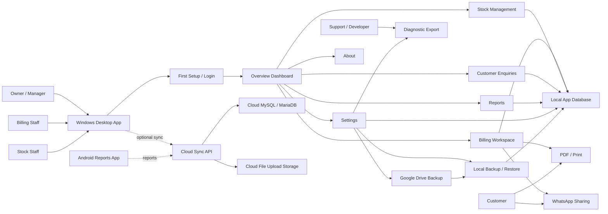
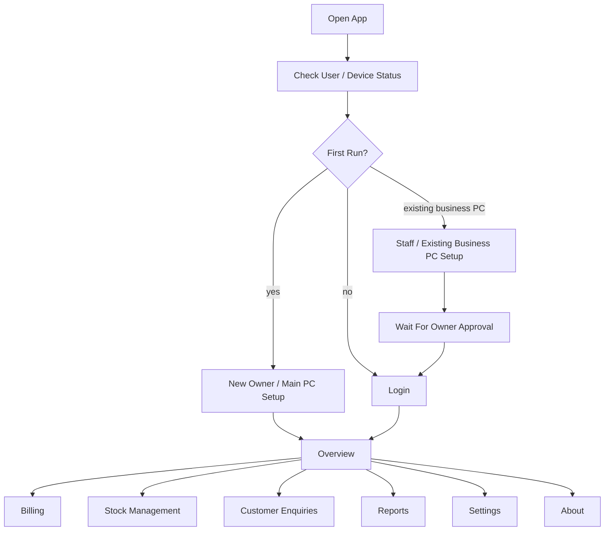
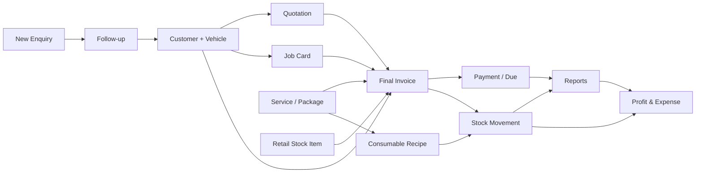
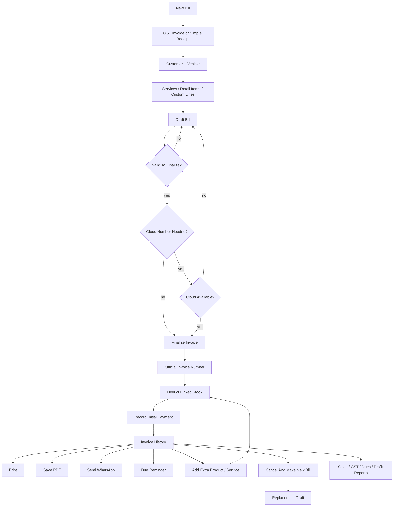
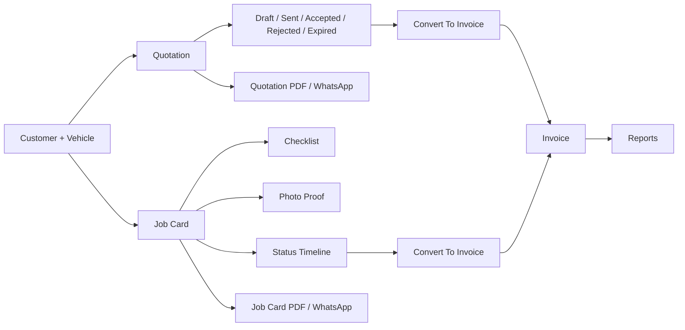
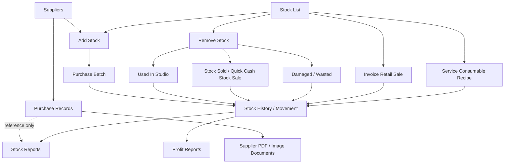
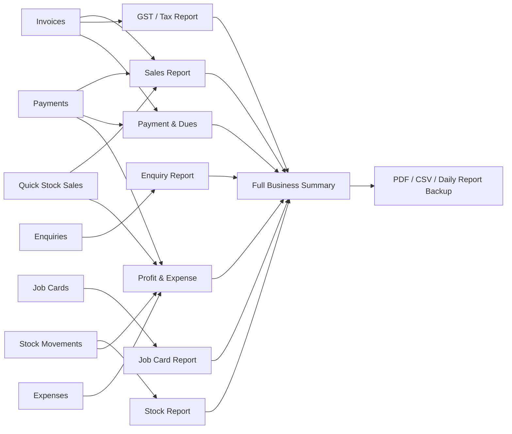
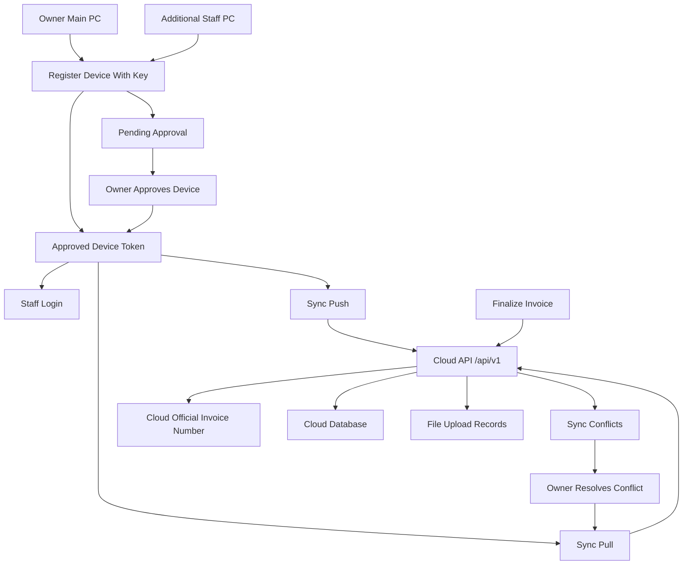
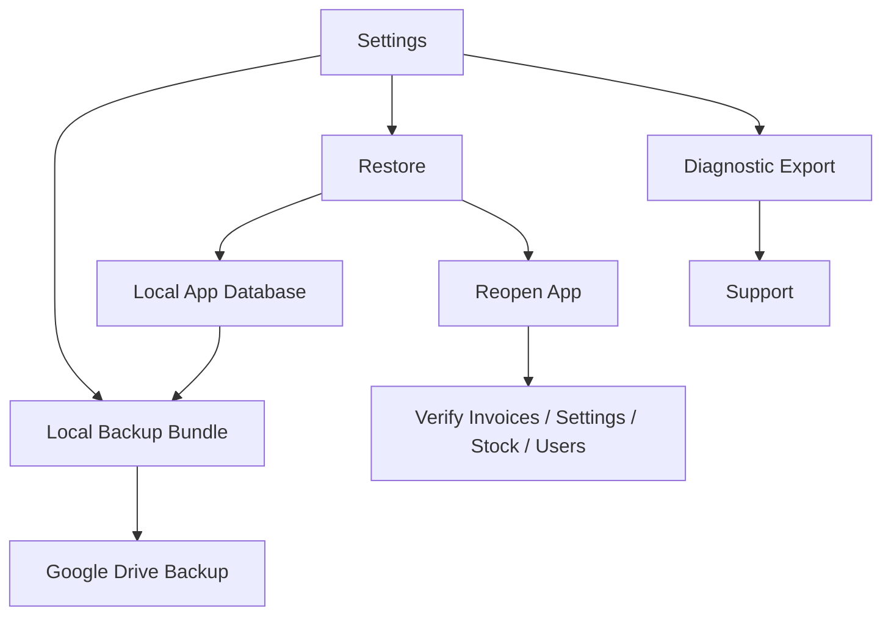
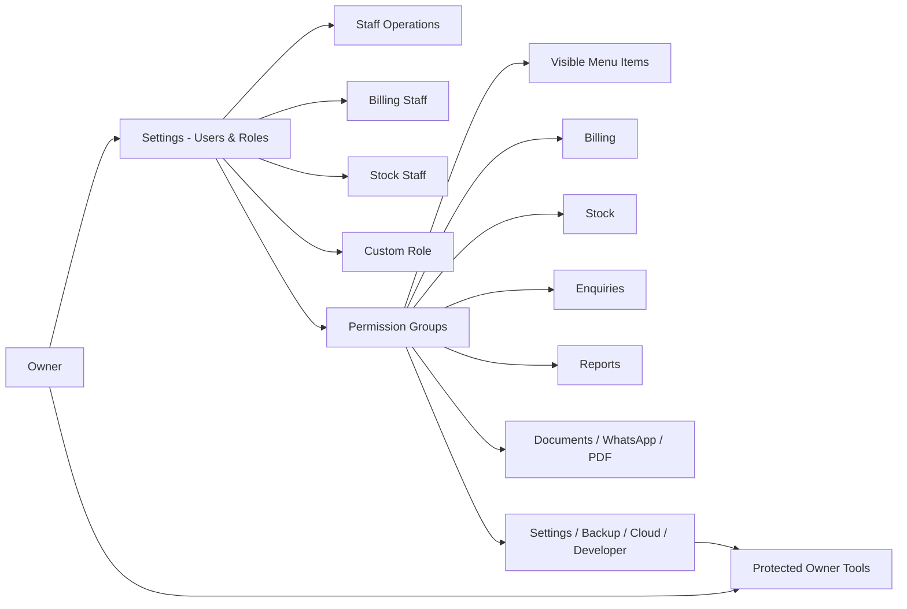

# Autocare24 Billing Wireflow Diagram

Visual project map for Autocare24 Billing.

This document uses Mermaid diagrams. Open it in a Markdown preview that supports Mermaid to see the diagrams rendered.

Related guide: [USER_MANUAL.md](USER_MANUAL.md).

## 1. Full Project Wireflow

## 2. Main Screen Navigation Wireflow

## 3. Business Workflow Wireflow

## 4. Billing And Invoice Lifecycle

## 5. Quotation And Job Card Flow

## 6. Stock Management Flow

## 7. Reports And Accounting Flow

## 8. Cloud Sync And Multi-PC Flow

## 9. Backup, Restore, And Support Flow

## 10. Access And Permission Flow

## 11. Reading The Diagram

- Solid arrows show normal user or data movement.
- Dotted arrows show optional or reference-only connections.
- Billing, stock, enquiries, reports, settings, backup, and cloud sync are connected through shared business records.
- Purchase Records are document references only; they do not increase stock and do not become expenses.
- Quick stock sales are stock movements and reporting entries; they are separate from GST invoice billing.
- Cloud sync helps multi-PC operation and official invoice numbering, but backup is still required.
